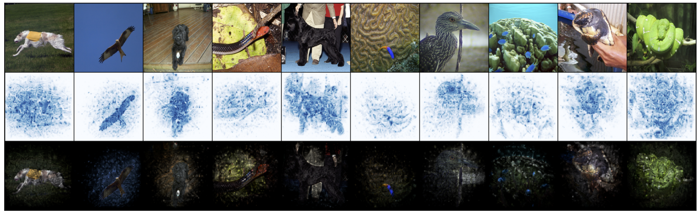

# Distilling Cognitive Backdoor Patterns within an Image: A SOTA Method for Backdoor Sample Detection

Code for ICLR 2023 Paper ["Distilling Cognitive Backdoor Patterns within an Image"](https://openreview.net/pdf?id=S3D9NLzjnQ5)

--- 
## Use Cognitive Distilation on a pretrained model and images. 
- **lr:** the learning rate (step size) for extracting the mask.
- **p**: the L_p norm constraint of the mask.
- **gamma (alpha used in the paper) and beta**: hyperparameters for the objective function. 
- **num_steps***: number of steps for extracting the mask.
- **preprocessor:** image preprocessor. Example: if input normalization is used, use `torchvision.transforms.Normalize(mean, std)` if none, use `torch.nn.Identity()`.
```python
from cognitive_distillation import CognitiveDistillation

images = # batch of images (torch.Tensor) [b,c,h,w]
model = # a pre-trained model (torch.nn.Module)
preprocessor = torch.nn.Identity() # or torchvision.transforms.Normalize(mean, std)

cd = CognitiveDistillation(lr=0.1, p=1, gamma=0.01, beta=10.0, num_steps=100)
masks = cd(model, images, preprocessor=preprocessor) # the extracted masks (torch.Tensor) [b,1,h,w]
cognitive_pattern = images * masks # extracted cognitive pattern (torch.Tensor) [b,c,h,w]


```
---
## Visualizations of the masks and Cognitive Patterns



---
## Reproduce results from the paper
- Configurations for each experiment are stored in **configs/** folder.
- Trigger patterns can be downloaded from [NAD GitHub repo](https://github.com/bboylyg/NAD)
- ISSBA poisoned data can be downloaded from [ISSBA GitHub repo](https://github.com/yuezunli/ISSBA)
- Dynamic attack generator can be downloaded from [Dyanamic Attack GitHub repo](https://github.com/VinAIResearch/input-aware-backdoor-attack-release)
- For DFST attack, data can be generated from [DFST GitHub repo](https://github.com/Megum1/DFST)
- Other triggers (trigger folder in this repo) can be downloaded from this [Google Drive](https://drive.google.com/drive/folders/1U2r0Ov2S32Eb8TpolpXHzHTSLG6KdHfD?usp=sharing)
- Frequency detector model weights can be downloaded from this [Google Drive](https://drive.google.com/drive/folders/1U2r0Ov2S32Eb8TpolpXHzHTSLG6KdHfD?usp=sharing). Note that this model is trained on the GTSRB dataset (reproduced using PyTorch), based on [
frequency-backdoor](https://github.com/YiZeng623/frequency-backdoor/blob/main/Sec4_Frequency_Detection/Train_Detection.ipynb).


##### Train a model
- **$exp_path**: the path where you want to store experiment results, checkpoints, logs
- **$exp_config**: where the experiment config is located
- **$exp_name**: name of the specific experiment configurations (*.yaml)
```console
python train.py --exp_path $exp_path \
 --exp_config $exp_config \
 --exp_name $exp_name

```

##### Run detections
The following command will save the detection results (e.g., masks of Cognitive Distillation, a confidence score for other baselines) to $exp_path.
- **--method** argument specifies detection methods ['CD', 'ABL', 'Feature', 'FCT', 'STRIP'].
- **$gamma** is the hyperparameter value for Cognitive Distillation
- 'Feature' is used for extract deep features (used by AC and SS).
- ABL does not need to run detection. All training losses are stored in the $exp_path.

```console
python extract.py --exp_path $exp_path \
 --exp_config $exp_config \
 --exp_name $exp_name \
 --method "CD" --gamma $gamma
```
##### Run detections

The following command will check AUPRC/AUROC for the detection results.
- **--method** argument specifies detection methods ['CD', 'AC', 'ABL', 'FCT', 'Frequency', SS', 'STRIP'].
```console
python detect_analysis.py --exp_path $exp_path \
                          --exp_config $exp_config \
                          --exp_name $exp_name \
                          --gamma $gamma
```

## Citation
If you use this code in your work, please cite the accompanying paper:
```
@inproceedings{
huang2023distilling,
title={Distilling Cognitive Backdoor Patterns within an Image},
author={Hanxun Huang and Xingjun Ma and Sarah Monazam Erfani and James Bailey},
booktitle={ICLR},
year={2023},
}
```

## Acknowledgements
This research was undertaken using the LIEF HPC-GPGPU Facility hosted at the University of Melbourne. This Facility was established with the assistance of LIEF Grant LE170100200.
The authors would like to thank [Yige Li](https://github.com/bboylyg) for sharing the several triggers used in the experiments. 


## Part of the code is based on the following repo:
  - Dynamic Attack: https://github.com/VinAIResearch/input-aware-backdoor-attack-release
  - Spectral Signatures: https://github.com/MadryLab/backdoor_data_poisoning
  - STRIP: https://github.com/garrisongys/STRIP
  - NAD: https://github.com/bboylyg/NAD
  - ABL: https://github.com/bboylyg/ABL
  - ISSBA: https://github.com/yuezunli/ISSBA
  - Frequency: https://github.com/YiZeng623/frequency-backdoor
  - https://github.com/JonasGeiping/data-poisoning/blob/main/forest/filtering_defenses.py
